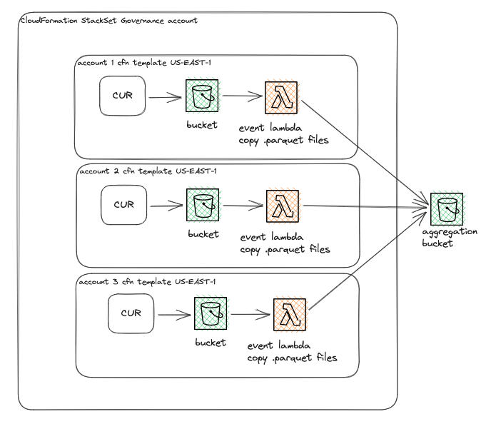

# Non-centralized Cost & Usage Reports

If you are responsible for multiple AWS accounts but don't have access to AWS Organizations or the payer account, it can be a chore and/or very expensive to gain aggregated insights into the costs of all AWS accounts you and your team have responsibility for.

This template creates an S3 bucket with a 2 year lifecycle, and a CUR for the account. It also creates a lambda function which will copy CURs to an aggregated bucket. The template can be used with Cloudformation StackSets.

It's deployed using Cloudformation StackSet from a governance account in the US-EAST-1 region.



## Using Athena

We can use AWS Athena to query the dataset of cost & usage reports. The recommendation is to collect each parquet file and partition them in S3 according to `s3://{bucketname}/{someprefix}/account={accountId}/year={year}/month={month}`

Example S3 URI:
`s3://cost-usage-report-123456789012/athena/account=161456459824/year=2023/month=10/`

With Athena some very complex queries can be run over very large datasets extremely quickly. For example, running this query which **checks which days had abnormally high costs according to the average** runs over a dataset containing double digit accounts with 6 months of CUR in just a few seconds:

```sql
WITH DailyCost AS (
  SELECT DATE(line_item_usage_start_date) AS usage_date, account,
    SUM(line_item_unblended_cost) AS daily_cost
  FROM cost_usage_report_for_athena
  WHERE line_item_line_item_type != 'Tax'
  GROUP BY DATE(line_item_usage_start_date), account
),
AverageCost AS (
  SELECT account, AVG(daily_cost) AS avg_daily_cost
  FROM DailyCost
  GROUP BY account
)
SELECT d.usage_date, d.account, d.daily_cost
FROM DailyCost d
JOIN AverageCost a ON d.account = a.account
WHERE d.daily_cost > a.avg_daily_cost
ORDER BY d.daily_cost DESC;
```

See [SQL directory](./sql/) for example queries.

# Deployment details
### "Fresh"/New Deployment gotcha
There's a circular dependency when deploying S3 buckets with Lambda triggers, [it's a known problem](https://aws.amazon.com/blogs/mt/resolving-circular-dependency-in-provisioning-of-amazon-s3-buckets-with-aws-lambda-event-notifications/).

To keep the template as brief as possible we have opted to not use the custom resource solution, and instead you will need to deploy the template twice.
1. Comment out the event part of the S3 bucket, and deploy
1. Once deployment is completed, remove the comment and deploy again

### US-EAST-1 requirement
Note that any deployment must be made from US-EAST-1, as it's the only region that supports the `AWS::CUR::ReportDefinition` resource.

### Manual management of StackSet, aggregation bucket
The StackSet in the governance account is manually managed, since we do not have access to AWS Organizations OU.

The aggregation bucket must have a bucket policy that allow the source accounts to write to it. The bucket policy is also manually managed. See [scripts directory](./scripts/) for a generation script based on accounts.

